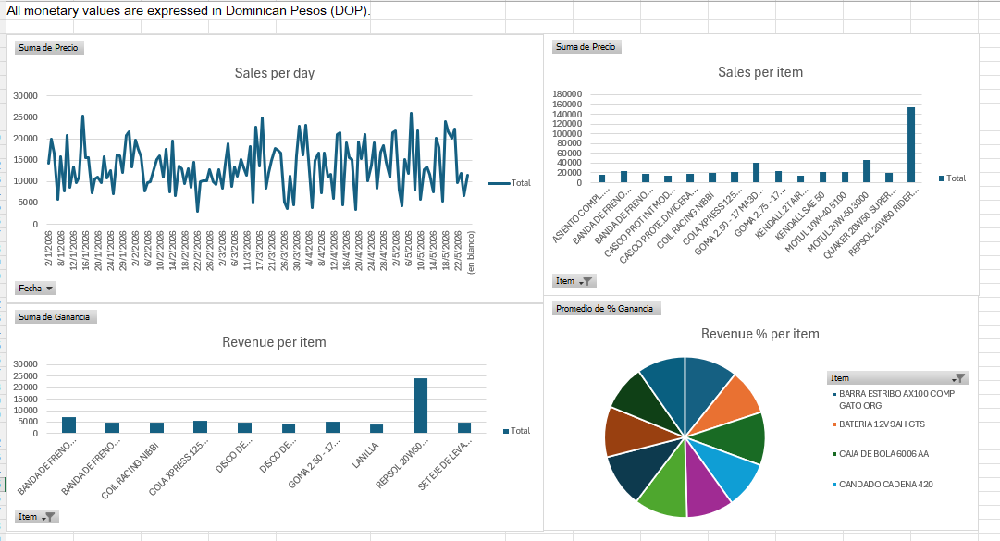

# 📊 Sales & Profitability Analysis (Excel Dashboard Project)

## 📌 Project Overview
This project analyzes sales and profitability data extracted from an ERP system. The goal is to identify key revenue drivers, evaluate product performance, and generate actionable business insights.

---

## 📁 Dataset
- Source: ERP export  
- Format: Excel (.xlsx)  
- Data includes:
  - Date
  - Product
  - Cost
  - Sales Price
  - Profit
  - Profit Margin (%)

All monetary values are expressed in Dominican Pesos (DOP). No currency conversion was applied.
---

## 🧹 Data Cleaning
- Removed unnecessary columns (Customer, Salesperson): 
- Eliminated empty rows
- Standardized date formats
- Converted numerical values correctly
- Corrected percentage calculations (used averages instead of sums)
Note: Customer and Salesperson data were excluded due to lack of variability in the dataset.

---

## 📊 Methodology
- Created pivot tables to analyze:
  - Sales trends over time
  - Top 10 products by revenue
  - Top 10 products by profit

- Applied filtering to focus on key business drivers

- Profit margins were aggregated using average values to ensure accurate representation.

---

## 📈 Dashboard

---

## 🧠 Key Insights

- The top 10 products generate a significant portion of total revenue, indicating reliance on key items.

- Most products maintain consistent profit margins around 20%–30%, indicating a standardized pricing approach across the business.

- Profitability varies across products, highlighting opportunities to prioritize high-margin items.

- Some products show lower margins, indicating potential inefficiencies in pricing or cost structure.

- Revenue distribution is uneven, with a small group of products generating most of the income.

---

## 💼 Business Value

This analysis helps identify key revenue drivers, evaluate pricing efficiency, and support data-driven decision-making for inventory and sales strategy optimization.

---
    
## 🚀 Tools Used 
- Microsoft Excel
- Pivot Tables
- Data Visualization
